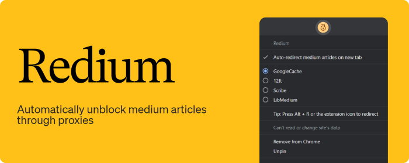

<h1 align="center"> Redium</h1>

 

 

Automatically unblock medium articles through proxies such as <a href="https://readmedium.com">ReadMedium</a>, <a href="https://freedium.cfd">Freedium</a>, and <a href="https://archive.today">Archive.today</a>.

> [!TIP]
> Click the extension icon or press `Alt + R` to redirect manually.

## Build

1. [Download this repo](https://github.com/ni554n/redium/archive/refs/heads/main.zip) and extract it somewhere permanent
2. `cd` into the extracted **_redium-main_** folder and run `npm install` and `npm run build`
3. Go to [Chrome Extensions](chrome://extensions/) page and enable `Developer Mode` from the top right corner
4. Click `Load Unpacked` button and select the folder

## Changelog

### v3.0

- Remove proxy services that no longer works
- Added ReadMedium, Freedium, and Archive.today

### v2.0

- Added a keyboard shortcut: `Alt + R` to manually redirect any website to the proxy.
- Added Google Web Cache as the new default proxy. Other proxy services are currently failing to unblock premium articles due to the recent changes made to Medium. However, we can still read the cached version of a premium article through Google Web Cache. But it has some limitations:
  - Recent articles may take a few days before Google caches them.
  - Dynamic iframes inside articles won't be loaded, so we are limited to only texts and images.

### v1.0

- Initial release.

## Information

**Author:** [Nissan Ahmed](https://anissan.com) ([@ni554n](https://twitter.com/ni554n))

**Donate:** [PayPal](https://paypal.me/ni554n)

