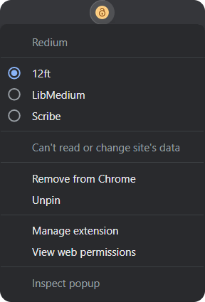

<h1> Redium</h1>

Automatically unblock articles through proxies like [12ft](https://12ft.io), [LibMedium](https://libmedium.batsense.net), and [Scribe](https://scribe.rip).

However, it **won’t** auto redirect if you are on medium.com webpage so that free articles can be read as usual.

But if you open the article in a new tab, or manually click the extension icon, it'll redirect that webpage to the selected proxy. You can also assign a [keyboard shortcut](chrome://extensions/shortcuts) to trigger redirection.

> 🔥 12ft supports bypassing articles on other websites apart from medium.com.

## Installation

> I'm in the process of uploading this to the Chrome Web Store. So wait a few days if don't want to install it manually.

1. [Download this repo](https://github.com/ni554n/redium/archive/master.zip) and extract it somewhere permanent.
2. Go to [Chrome Extensions](chrome://extensions/) page and enable `Developer Mode` from the top right corner.
3. Click `Load Unpacked` button and select the previously extracted folder.

## Information

**Author:** [Nissan Ahmed](https://ni554n.github.io) ([@ni554n](https://twitter.com/ni554n))

**Donate:** [PayPal](https://paypal.me/ni554n)
